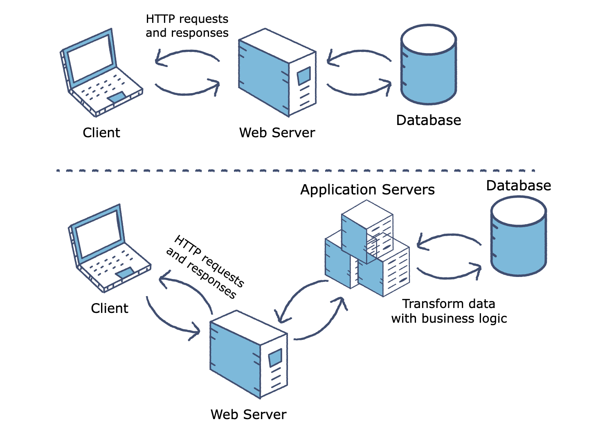
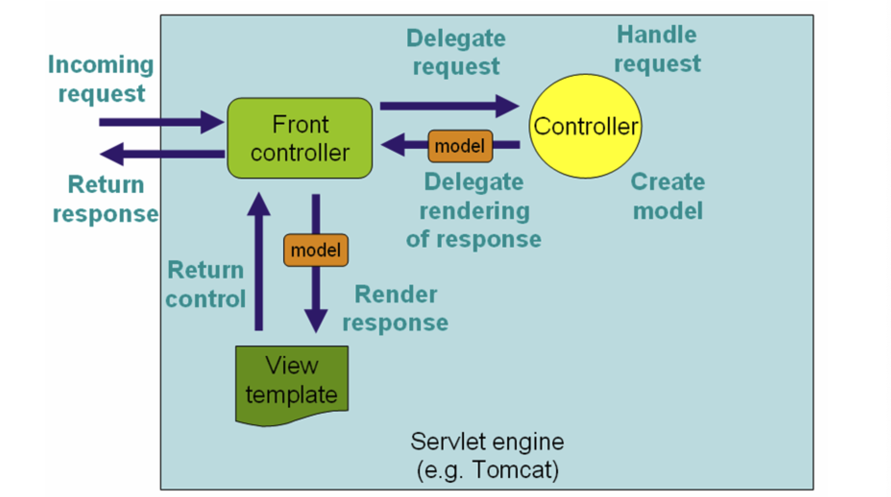

# 5. Spring Web MVC

## 학습키워드

- Spring
- Spring Boot
- Spring initializer
- Web Server와 Web Application Server(WAS)
  - Tomcat
- Model-View-Controller(MVC) 아키텍처 패턴
- 관심사의 분리(Seperation of Concern)
- Spring MVC
- Java Annotation
- Spring Annotation
  - @RestController
        - @Controller
        - @ResponseBody
    - @GetMapping
      - @RequestMapping

---

### Spring

- 스프링은 스프링 프레임워크 자체를 지칭할 수도 있고 스프링 프레임워크 위에 구축된 프로젝트 제품군 전체를 지칭하기도 한다
- 스프링 프레임워크는 모듈로 나눠진다. 핵심에는 코어 컨테이너가 있다
- 스프링 프레임워크는 메시징, 데이터 트랜잭션 및 영속성과 웹을 지원한다

### Spring Boot

- 스프링부트를 사용하면 `java -jar`로 실행할 수 있는 자바 애플리케이션 또는 war 배포파일을 만들 수 있다

### Spring initializr

- Spring Initializr는 JVM기반 프로젝트를 생성하는 API를 제공한다
- Spring Initializr를 통해 종속성과 버전 같은 프로젝트 생성에 필요한 메타데이터를 살펴볼 수 있다
- 빌드시스템, 패키징, 언어, 플랫폼버전, 종속성 등 프로젝트를 커스터마이징 할 수 있다

---

### Web Server vs WAS(Web Application Server)

  
(출처: <https://www.educative.io/answers/web-server-vs-application-server>)

### Tomcat

- Apache tomcat은 Jakarta EE platform 명세 중 일부를 구현한 오픈소스 프로그램이다

#### 웹 애플리케이션의 레이아웃

- ***.html, *.jsp, etc.**: 최상위 디렉터리는 문서루트(document root)에 위치
  만약 /index.html를 참조하면 문서루트에서 index.html파일을 찾는다
- **/WEB-INF/web.xml**: 배포설명자(Web Application Deployment Descriptor)  
  서블릿, 다른 구성요소, 초기화 매개변수 보안 등을 설정
- **/WEB-INF/classes/**: 모든 java 클래스파일(JARv파일 X)과 관련 리소스파일
- **/WEB-INF/lib/**: 라이브러리 JAR파일
- **/META-INF/context.xml**: 로그 액세스, 데이터소스, 세션매니저 등을 설정

#### 소스코드 레이아웃

- **src/**: 자바 소스파일
- **web/**: 정적컨텐츠(HTML, JSP, JS, CSS, images ...)  
  하위 디렉터리 구조는 해당 파일에 엑세스하는 요청URI에 반영  
  이 디렉터리는 웹 애플리케이션의 문서루트가 된다
- **web/WEB-INF/**: web.xml, tag library discriptor, 리소스파일 등 위치한다  
  서블릿 명세 상 클라이언트 요청에 이 디렉터리의 콘텐츠 제공을 금지한다

#### 배포

1. 디렉터리을 $CATALINA_BASE/webapps/에 위치  
  디렉터리 이름을 기반으로 컨텍스트 경로 할당
2. WAR파일을 $CATALINA_BASE/webapps/에 위치  
  Tomcat 시작시 압축해제해서 실행
  교체시 WAR파일 및 압축해제한 디렉터리 삭제 후 tomcat 재시동
3. Tomcat의 "Manager" 이용하여 배포 및 배포취소

- 표준 서블릿 API 명세상 모든 컨테이너는 WAR파일 배포

---

### Model-View-Controller(MVC) 아키텍처 패턴

#### 모델(mode)

- 도메인에 대한 정보  
  UI에 직접 사용되지 않는 모든 데이터와 동작을 포함하는 비시각적인 객체

#### 뷰(view)

- UI에서 모델을 표시하는 역할  
  정보를 표시하는 역할만 한다

#### 컨트롤러(Controller)

- 사용자로부터 입력을 받고, 모델을 조작하며, 뷰를 적절하게 업데이트한다

#### 프레젠테이션과 모델의 분리

- 뷰와 모델은 서로 다른 관심사다  
  뷰를 개발할 때는 UI의 메커니즘, 사용자 인터페이스에 집중하는 반면, 모델을 개발할 때는 비즈니스 정책이나 데이터베이스 상호작용을 고려한다  
  뷰와 모델을 개발할 때 서로 다른 라이브러리를 사용
- 뷰와 모델을 분리하면 동일한 모델 코드로 프레젠테이션을 여러 가지 인터페이스로 개발 가능
- 비시각적인 모델만 분리하여 테스트하기 용이하다
- (한방향) 프레젠테이션은 모델에 의존하지만 모델은 프레젠테이션에 의존하지 않는다  
  모델을 개발하는 개발자는 프레젠테이션이 사용되고 있다는걸 전혀 알 필요가 없다
- 한 프레젠테이션에서 모델을 변경하는 경우 다른 프레젠테이션에서도 변경 사항을 반영해야 한다

---

### Spring MVC

#### 정의

- Spring Web MVC는 서블릿 API를 기반으로 구축된 웹 프레임워크

#### DispatcherServlet

- 컨트롤러에 요청(request)를 디스패치하고 기타 기능을 제공한다
- Spring IoC 컨테이너와 통합되어 스프링의 다른 기능도 사용가능

  
(출처: <https://docs.spring.io/spring-framework/docs/3.2.x/spring-framework-reference/html/mvc.html>)

---

### Java Annotation

#### 어노테이션 정의

```java
@interface name {
    type element();
    ...
}
```

#### 요소(element)

- 어노테이션 내에 선언된 메서드
- 반환값이 있고 매개변수는 없는 추상메서드의 형태
- 요소의 반환값타입은 기본형(primitive type), String, enum, 애너테이션,
Class만 허용된다
- 예외를 선언할 수 없다
- 상수 선언은 허용된다
- 적용할 때 이 요소들의 값을 모두 지정해야한다 (순서무관, 기본값 제외)  
- 애너테이션 요소가 하나이고 이름이 value인 경우 적용시 요소 이름 생략가능

```java
@interface TestInfo {
    String value();
}

@TestInfo("passed")
class NewClass {
    ...
}
```

- 요소의 반환값타입이 배열인 경우 괄호({})를 사용해서 여러 값 지정

#### 메타 어노테이션(meta annotation)

- 어노테이션을 정의하는데 사용되는 어노테이션의 어노테이션
- 어노테이션을 정의할 때 어노테이션의 적용대상(target)이나 유지기간(retention) 등을 지정하는데 사용

#### 마커 애너테이션(marker annotation)

- 요소가 하나도 정의되지 않은 애너테이션

---

### Spring annotation

#### 결합 어노테이션(composed annotation)

- ex. @TransactionalService는 @Transactional과 @Service 어노테이션의 의미가 결합된 어노테이션

@RestController

- @Controller와 @ResponseBody가 붙은 어노테이션
- 모든 메서드가 뷰 대신 도메인객체를 반환하는 컨트롤러 클래스를 의미

@Controller

- @Component의 스테레오타입
- @ComponentScan의 대상이 된다

@ResponseBody

- @ResponseBody가 선언된 메서드가 리턴하는 객체는 HttpMessageConverter를 사용하여 JSON 개겣로 변환된다

@GetMapping

- @RequestMapping(method=RequestMethod.GET) 애너테이션과 그 속성을 @GetMapping 하나로 대체해준다

@RequestMapping

- 컨트롤러클래스 안의 핸들리메서드와 사용자요청을 매핑한다
- 스프링 MVC 프레임워크의 RequestMappingHandlerMapping 컴포넌트가 사용자요청과 핸들러 매핑정보를 관리한다. DispatcherServlet이 클라이언트 요청을 처리할 때 RequestMappingHandlerMapping 컴포넌트의 메서드를 사용해 요청과 매칭되는 핸들러메서드를 조회한다
